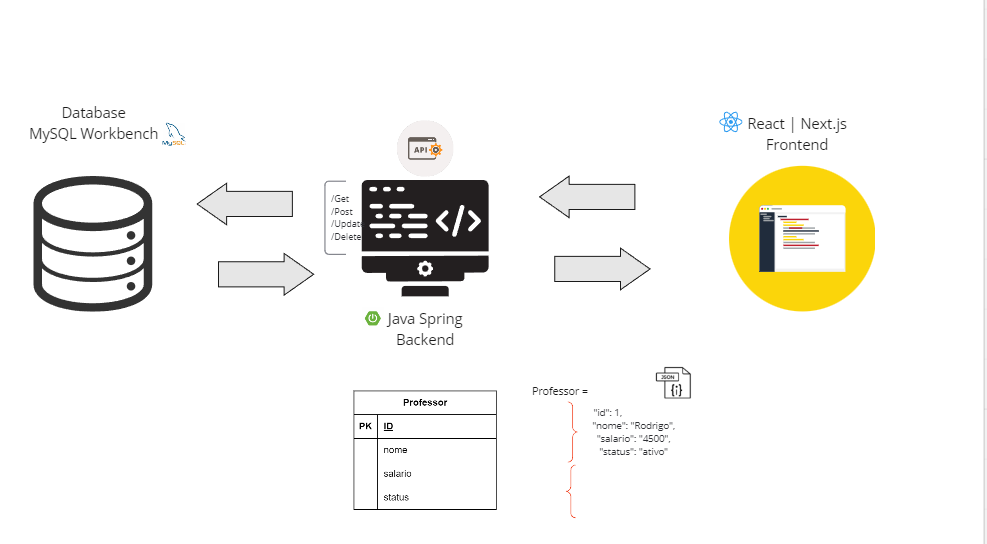

# Backend do Projeto Universo Inclusivo

## Arquitetura 

Link da aprensentação https://miro.com/app/board/uXjVN0v_QLg=/



Bem-vindo ao backend do projeto Universo Inclusivo! Este README fornecerá informações essenciais para configurar e executar o backend do projeto em sua máquina local.

### Pré-requisitos

Antes de começar, certifique-se de ter os seguintes pré-requisitos instalados em sua máquina:

- ava JDK 8 ou superior
  
- Maven

- MySQL (com MySQL Workbench, opcional)

- Spring Boot
  
### Configuração do Banco de Dados

1. Crie um banco de dados MySQL chamado `universo_inclusivo.` 

2. Configure o arquivo `application.properties` no diretório `src/main/resources `com as informações do seu banco de dados:

```properties

spring.datasource.url=jdbc:mysql://localhost:3306/universo_inclusivo
spring.datasource.username=seu_usuario
spring.datasource.password=sua_senha
spring.datasource.driver-class-name=com.mysql.cj.jdbc.Driver

```   
Certifique-se de substituir seu_usuario e sua_senha pelos detalhes do seu banco de dados.


### Execução do Backend

1. Abra um terminal na raiz do projeto.

2. Execute o seguinte comando para compilar e executar o backend:

```bash

mvn spring-boot:run
```
O Spring Boot iniciará o servidor na porta padrão `8080.`

# Endpoints Disponíveis

- `GET /professores:` Retorna a lista de professores.

- `GET /professores/{id}:` Retorna os detalhes de um professor específico.

- `POST /professores:` Adiciona um novo professor.

- `PUT /professores/{id}:` Atualiza os detalhes de um professor existente.

- `DELETE /professores/{id}:` Remove um professor.


### Contribuições

Se você deseja contribuir para o backend do projeto Universo Inclusivo, siga as instruções descritas no README principal.

Para mais informações ou dúvidas, entre em contato com a Squad-39 pelo e-mail rodrigo.santos@aluno.recode.org.br.

Agradecemos por fazer parte deste projeto que promove a diversidade e inclusão!


